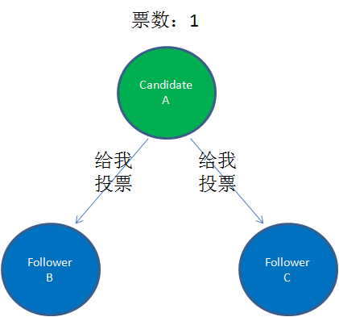
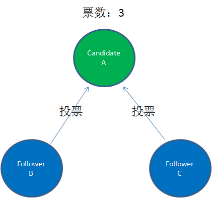
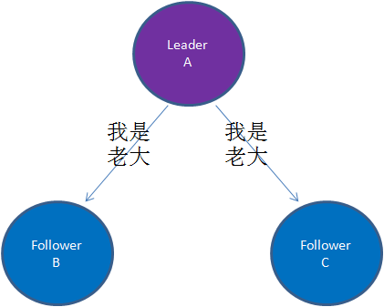
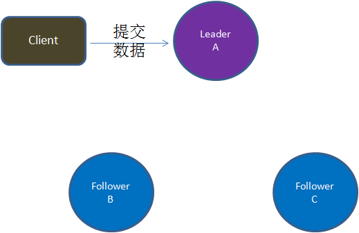
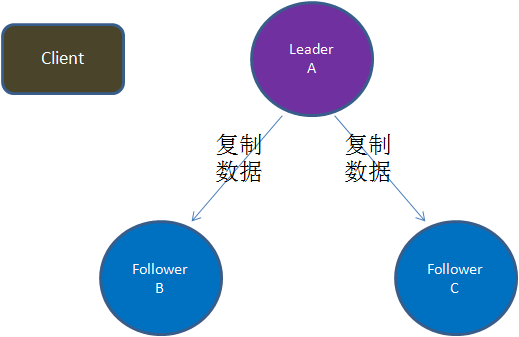
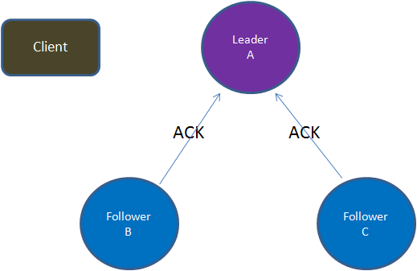

## 拜占庭将军问题

### 拜占庭描述

拜占庭问题是一位计算机科学家提出的网络中通信一致性的问题。

在很久很久以前，拜占庭是东罗马帝国的首都。那个时候罗马帝国国土辽阔，为了防御目的，因此每个军队都分隔很远，将军与将军之间只能靠信使传递消息。在打仗的时候，拜占庭军队内所有将军必需达成一致的共识，才能更好地赢得胜利。但是，在军队内有可能存有叛徒，扰乱将军们的决定。

这时候，在已知有成员不可靠的情况下，其余忠诚的将军需要在不受叛徒或间谍的影响下达成一致的协议。

通过这个比喻，表达了计算机网络中一致性问题，这个问题称为拜占庭将军问题

### 解决方案-Raft算法

Raft算法的核心知识是两点：
- 选取主节点
- 同步数据

#### 选取主节点

Raft算法为节点定义了三种角色:
1. Leader(主节点)
2. Follower(从节点)
3. Candidate(参与投票竞争的节点)

选举主节点的流程如下:

(1).在最初，还没有一个主节点的时候，所有节点的身份都是Follower。每一个节点都有自己的计时器，当计时达到了超时时间（Election Timeout），该节点会转变为Candidate。

(2).成为Candidate的节点，会首先给自己投票，然后向集群中其他所有的节点发起请求，要求大家都给自己投票

(3).其他收到投票请求且还未投票的Follower节点会向发起者投票，发起者收到反馈通知后，票数增加。

(4).当得票数超过了集群节点数量的一半，该节点晋升为Leader节点。Leader节点会立刻向其他节点发出通知，告诉大家自己才是老大。收到通知的节点全部变为Follower，并且各自的计时器清零

这里需要说明一点，每个节点的超时时间都是不一样的。比如A节点的超时时间是3秒，B节点的超时时间是5秒，C节点的超时时间是4秒。这样一来，A节点将会最先发起投票请求，而不是所有节点同时发起。

Leader节点需要每隔一段时间向集群其他节点发送心跳通知，表明存活。一旦Leader节点挂掉，发不出通知，那么计时达到了超时时间的Follower节点会转变为Candidate节点，发起选主投票，周而复始......

#### 同步数据

Raft算法同步数据的方式和XA两阶段提交类似。

(1). 由客户端提交数据到Leader节点

(2). 由Leader节点把数据复制到集群内所有的Follower节点。如果一次复制失败，会不断进行重试

(3). Follower节点们接收到复制的数据，会反馈给Leader节点

(4). 如果Leader节点接收到超过半数的Follower反馈，表明复制成功。于是提交自己的数据，并通知客户端数据提交成功

(5). 由Leader节点通知集群内所有的Follower节点提交数据，从而完成数据同步流程

### 其他算法

- Paxos算法
- ZAB算法
- PBFT算法