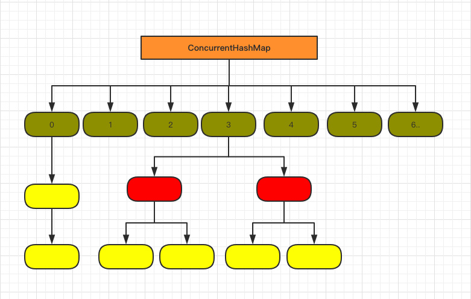

### java7 中 ConcurrnentHashMap分析

#### 1. 数据结构
基于JDK7的`ConcurrentHashMap`的底层数据结构仍然是数组和链表。与HashMap不同的是，ConcurrentHashMap最外层不是一个大的数组，而是一个`Segment`数组。每个Segment包含一个与HashMap数据结构差不多的链表数组。整体数据结构如下图所示:


Segment  默认是 16，也就是说 ConcurrentHashMap 有 16 个 Segments，所以理论上，这个时候，最多可以同时支持 16 个线程并发写，只要它们的操作分别分布在不同的 Segment 上。这个值可以在初始化的时候设置为其他值，但是一旦初始化以后，它是不可以扩容的。

#### 2. 初始化

```
public ConcurrentHashMap(int initialCapacity,
                         float loadFactor, int concurrencyLevel) {
    // loadFactor 负载因子， concurrencyLevel 并发数，也是 segment 个数
    if (!(loadFactor > 0) || initialCapacity < 0 || concurrencyLevel <= 0)
        throw new IllegalArgumentException();
    if (concurrencyLevel > MAX_SEGMENTS)
        concurrencyLevel = MAX_SEGMENTS;
    int sshift = 0;
    int ssize = 1;
    // 计算并行级别 ssize，因为要保持并行级别是 2 的 n 次方
    while (ssize < concurrencyLevel) {
        ++sshift;
        ssize <<= 1;
    }
    // 假如使用默认值，concurrencyLevel 为 16，sshift 为 4
    // 那么计算出 segmentShift 为 28，segmentMask 为 15，后面会用到这两个值
    this.segmentShift = 32 - sshift;
    this.segmentMask = ssize - 1;

    if (initialCapacity > MAXIMUM_CAPACITY)
        initialCapacity = MAXIMUM_CAPACITY;

    // initialCapacity 是设置整个 map 初始的大小，
    // 这里根据 initialCapacity 计算 Segment 数组中每个位置可以分到的大小
    // 如 initialCapacity 为 64，那么每个 Segment 可以分到 4 个
    int c = initialCapacity / ssize;
    if (c * ssize < initialCapacity)
        ++c;
    // 默认 MIN_SEGMENT_TABLE_CAPACITY 是 2，这个值也是有讲究的，因为这样的话，对于具体的槽上，
    // 插入一个元素不至于扩容，插入第二个的时候才会扩容
    int cap = MIN_SEGMENT_TABLE_CAPACITY; 
    while (cap < c)
        cap <<= 1;

    // 创建 Segment 数组，
    // 并创建数组的第一个元素 segment[0]
    Segment<K,V> s0 =
        new Segment<K,V>(loadFactor, (int)(cap * loadFactor),
                         (HashEntry<K,V>[])new HashEntry[cap]);
    Segment<K,V>[] ss = (Segment<K,V>[])new Segment[ssize];
    // 往数组写入 segment[0]
    UNSAFE.putOrderedObject(ss, SBASE, s0); // ordered write of segments[0]
    this.segments = ss;
}
```

这里可以看到初始化完成后:

- Segment[i] 的默认大小为 2，负载因子是 0.75，得出初始阈值为 1.5，也就是以后插入第一个元素不会触发扩容，插入第二个会进行第一次扩容
- 初始化了 segment[0]，其他位置还是 null
- 当前 segmentShift （移位数）的值为 32 - 4 = 28，segmentMask(掩码) 为 16 - 1 = 15

#### 3. put操作

内部 HashEntry 类 :
``` java
public V put(K key, V value) {
    Segment<K,V> s;
    if (value == null)
        throw new NullPointerException();
    // 1. 计算 key 的 hash 值
    int hash = hash(key);
    // 2. 根据 hash 值找到 Segment 数组中的位置 j
    // hash 是 32 位，无符号右移 segmentShift(28) 位，剩下高 4 位，
    //然后和 segmentMask(15) 做一次与操作，也就是说 j 是 hash 值的高 4 位，也就是 Segment 的数		组下标
    int j = (hash >>> segmentShift) & segmentMask;
    // 刚刚说了，初始化的时候初始化了 segment[0]，但是其他位置还是 null，
    // ensureSegment(j) 对 segment[j] 进行初始化
    if ((s = (Segment<K,V>)UNSAFE.getObject          // nonvolatile; recheck
         (segments, (j << SSHIFT) + SBASE)) == null) //  in ensureSegment
        s = ensureSegment(j);
    // 3. 插入新值到 槽 s 中
    return s.put(key, hash, value, false);
}
```

对于写操作，并不要求同时获取所有Segment的锁，因为那样相当于锁住了整个Map。它会先获取该Key-Value对所在的Segment的锁，获取成功后就可以像操作一个普通的HashMap一样操作该Segment，并保证该Segment的安全性。

首先也是先通过key的hash定位到具体的segment， 与HashMap不同的是，ConcurrentHashMap会在put之前就进行一次扩容校验。HashMap 是插入元素之后再看是否需要扩容，有可能扩容之后后续就没有插入就浪费了本次扩容(扩容非常消耗性能)

#### size方法

put、remove和get操作只需要关心一个Segment，而size操作需要遍历所有的Segment才能算出整个Map的大小。put、remove和get操作只需要关心一个Segment，而size操作需要遍历所有的Segment才能算出整个Map的大小。一个简单的方案是，先锁住所有Sgment，计算完后再解锁。但这样做，在做size操作时，不仅无法对Map进行写操作，同时也无法进行读操作，不利于对Map的并行操作。

为更好支持并发操作，ConcurrentHashMap会在不上锁的前提逐个Segment计算3次size，如果某相邻两次计算获取的所有Segment的更新次数（每个Segment都与HashMap一样通过modCount
跟踪自己的修改次数，Segment每修改一次其modCount加一）相等，说明这两次计算过程中无更新操作，则这两次计算出的总size相等，可直接作为最终结果返回。如果这三次计算过程中Map有更新，则对所有Segment加锁重新计算Size。

#### 与HashMap的比较

ConcurrentHashMap与HashMap相比，有以下不同点：
- ConcurrentHashMap线程安全，而HashMap非线程安全
- HashMap允许Key和Value为null，而ConcurrentHashMap不允许
- HashMap不允许通过Iterator遍历的同时通过HashMap修改(fail-fast异常)，而ConcurrentHashMap允许该行为，并且该更新对后续的遍历可见


### java8 中的实现

Java 8为进一步提高并发性，摒弃了分段锁的方案，而是直接使用一个大的数组，采用了 `CAS + synchronized` 来保证并发安全性。同时为了提高哈希碰撞下的寻址性能，Java 8在链表长度超过一定阈值（8）时将链表（寻址时间复杂度为O(N)）转换为红黑树（寻址时间复杂度为O(long
(N))）。其数据结构如下图所示：



#### Node结构(HashEntry)

将 1.7 中存放数据的 HashEntry 改为 Node，但作用都是相同的, 其中val，next都采用volatile修饰，保证了可见性
```
static class Node<K,V> implements Map.Entry<K,V> {
    final int hash;
    final K key;
    volatile V val;
    volatile Node<K,V> next;

    Node(int hash, K key, V val, Node<K,V> next) {
        this.hash = hash;
        this.key = key;
        this.val = val;
        this.next = next;
    }

    public final K getKey()       { return key; }
    public final V getValue()     { return val; }
    public final int hashCode()   { return key.hashCode() ^ val.hashCode(); }
    public final String toString(){ return key + "=" + val; }
    public final V setValue(V value) {
        throw new UnsupportedOperationException();
}
```

#### put方法

put方法如下:
``` 
    final V putVal(K key, V value, boolean onlyIfAbsent) {
        if (key == null || value == null) throw new NullPointerException();
        int hash = spread(key.hashCode());
        int binCount = 0;
        for (Node<K,V>[] tab = table;;) { // 步骤1
            Node<K,V> f; int n, i, fh;
            if (tab == null || (n = tab.length) == 0) // 步骤2
                tab = initTable();
            else if ((f = tabAt(tab, i = (n - 1) & hash)) == null) { // 步骤3
                if (casTabAt(tab, i, null,
                             new Node<K,V>(hash, key, value, null)))
                    break;                   // no lock when adding to empty bin
            }
            else if ((fh = f.hash) == MOVED) // 步骤4
                tab = helpTransfer(tab, f);
            else {
                V oldVal = null;
                synchronized (f) { // 步骤5
                    if (tabAt(tab, i) == f) {
                        if (fh >= 0) {
                            binCount = 1;
                            for (Node<K,V> e = f;; ++binCount) {
                                K ek;
                                if (e.hash == hash &&
                                    ((ek = e.key) == key ||
                                     (ek != null && key.equals(ek)))) {
                                    oldVal = e.val;
                                    if (!onlyIfAbsent)
                                        e.val = value;
                                    break;
                                }
                                Node<K,V> pred = e;
                                if ((e = e.next) == null) {
                                    pred.next = new Node<K,V>(hash, key,
                                                              value, null);
                                    break;
                                }
                            }
                        }
                        else if (f instanceof TreeBin) {
                            Node<K,V> p;
                            binCount = 2;
                            if ((p = ((TreeBin<K,V>)f).putTreeVal(hash, key,
                                                           value)) != null) {
                                oldVal = p.val;
                                if (!onlyIfAbsent)
                                    p.val = value;
                            }
                        }
                    }
                }
                if (binCount != 0) {
                    if (binCount >= TREEIFY_THRESHOLD) // 步骤6
                        treeifyBin(tab, i);
                    if (oldVal != null)
                        return oldVal;
                    break;
                }
            }
        }
        addCount(1L, binCount);
        return null;
    }
```
流程如下:
1. 根据 key 计算出 hashcode
2. 判断是否需要进行初始化
3. f 即为当前 key 定位出的 Node，如果为空表示当前位置可以写入数据，利用 CAS 尝试写入，失败则自旋保证成功
4. 如果当前位置的 hashcode == MOVED == -1,则需要进行扩容
5. 如果都不满足，则利用 synchronized 锁写入数据
6. 如果数量大于 TREEIFY_THRESHOLD 则要转换为红黑树。


#### get方法

``` 
    public V get(Object key) {
        Node<K,V>[] tab; Node<K,V> e, p; int n, eh; K ek;
        int h = spread(key.hashCode());
        if ((tab = table) != null && (n = tab.length) > 0 &&
            (e = tabAt(tab, (n - 1) & h)) != null) {
            if ((eh = e.hash) == h) {
                if ((ek = e.key) == key || (ek != null && key.equals(ek)))
                    return e.val;
            }
            else if (eh < 0)
                return (p = e.find(h, key)) != null ? p.val : null;
            while ((e = e.next) != null) {
                if (e.hash == h &&
                    ((ek = e.key) == key || (ek != null && key.equals(ek))))
                    return e.val;
            }
        }
        return null;
    }
```

1. 根据计算出来的 hashcode 寻址，如果就在桶上那么直接返回值。
2. 如果是红黑树那就按照树的方式获取值
3. 都不满足那就按照链表的方式遍历获取值


### 参考资料

- [ConcurrentHashMap的演进](http://www.jasongj.com/java/concurrenthashmap/)
- [HashMap与ConcurrentHashMap](https://gitbook.cn/books/5a51ef3743ebf841f7e6fe86/index.html)
- [java7/8中的HashMap/ConcurrentHashMap](https://javadoop.com/post/hashmap)
- [吊打面试官ConcurrentHashMap](https://juejin.im/post/5df8d7346fb9a015ff64eaf9)