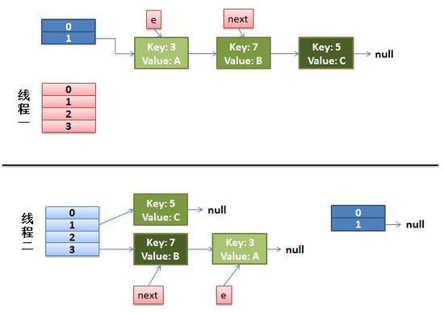

### 1.概述
基于JDK1.7的HashMap，使用拉链法来解决hash冲突


### 2.基本逻辑

#### 1)常量
``` 
// 初始容量，扩容容量必须是2的倍数
static final int DEFAULT_INITIAL_CAPACITY = 16;

// 最大容量，2的30次方  
static final int MAXIMUM_CAPACITY = 1 << 30;

// 加载因子，当长度大于阈值(存储容量*加载因子)，则进行扩容
static final float DEFAULT_LOAD_FACTOR = 0.75f;

// 阈值，达到阈值后进行resize扩容操作
int threshold;

// 存储Entry的数组
transient Entry<K,V>[] table;
```

#### 2)Entry
``` 
static class Entry<K,V> implements Map.Entry<K,V> {
    final K key;
    V value;
    // 下一个节点
    Entry<K,V> next;
    int hash;
    // 构造函数，每次用新节点作为链表的头结点
    Entry(int h, K k, V v, Entry<K,V> n) {
        value = v;
        next = n;
        key = k;
        hash = h;
    }
    // ..... 
}
```

#### 3）put操作

1. 通过key的hash值确定table下标 
2. 查找table下标，如果key存在则更新对应的value 
3. 如果key不存在则调用addEntry()方法 
``` 
public V put(K key, V value) {
    if (table == EMPTY_TABLE) {
        // 第一个元素需要先初始化数组大小
        inflateTable(threshold);
    }
    // 键为 null 单独处理, 最终这个 entry 会放入 table[0]
    if (key == null)
        return putForNullKey(value);
    int hash = hash(key);
    // 确定桶下标
    int i = indexFor(hash, table.length);
    // 先找出是否已经存在键为 key 的键值对，如果存在的话就更新这个键值对的值为 value
    for (Entry<K,V> e = table[i]; e != null; e = e.next) {
        Object k;
        if (e.hash == hash && ((k = e.key) == key || key.equals(k))) {
            V oldValue = e.value;
            e.value = value;
            e.recordAccess(this);
            return oldValue;
        }
    }

    modCount++;
    // 没有重复的 key， 添加这个 entry 到链表
    addEntry(hash, key, value, i);
    return null;
}
```


添加节点(Entry)到链表中, 使用头插法:
``` 
void addEntry(int hash, K key, V value, int bucketIndex) {
	// 如果当前 size 达到 threshold, 并且插入位置已经有元素， 需要扩容
    if ((size >= threshold) && (null != table[bucketIndex])) {
    	// 扩容到原来的两倍
        resize(2 * table.length);
        hash = (null != key) ? hash(key) : 0;
        bucketIndex = indexFor(hash, table.length);
    }
    createEntry(hash, key, value, bucketIndex);
}
// 放入链表的头节点
void createEntry(int hash, K key, V value, int bucketIndex) {
    Entry<K,V> e = table[bucketIndex];
    // Entry 的构造函数可以看出是头插法
    table[bucketIndex] = new Entry<>(hash, key, value, e);
    size++;
}
```

#### 4) 扩容操作
扩容根据以下几个属性来判断

| 参数  | 含义 |
| ------------- | ------------- |
| capacity  | table 的容量大小，默认为 16，需要注意的是 capacity 必须保证为 2 的次方  |
| size  | table 的实际使用量  |
| threshold  |size 的临界值，size 必须小于 threshold，如果大于等于，就必须进行扩容操作|
| load_factor  |table 能够使用的比例，threshold = capacity * load_factor|

当 size 达到 threshold 时，扩容到原来的两倍，并将原数组迁移到新数组中：


``` 
void resize(int newCapacity) {
    Entry[] oldTable = table;
    int oldCapacity = oldTable.length;
    if (oldCapacity == MAXIMUM_CAPACITY) {
        threshold = Integer.MAX_VALUE;
        return;
    }

    Entry[] newTable = new Entry[newCapacity];
    transfer(newTable);
    table = newTable;
    threshold = (int)(newCapacity * loadFactor);
}
// 将原来的Entry映射到新的数组
void transfer(Entry[] newTable) {
    Entry[] src = table;
    int newCapacity = newTable.length;
    for (int j = 0; j < src.length; j++) {
        Entry<K,V> e = src[j];
        if (e != null) {
            src[j] = null;
            do {
                Entry<K,V> next = e.next;
                int i = indexFor(e.hash, newCapacity);
                // 头插法进入新的数组
                e.next = newTable[i];
                newTable[i] = e;
                // 处理下一个节点
                e = next;
            } while (e != null);
        }
    }
}
```
### 3.HashMap的线程不安全体现
在resize的时候，会进行一步将原有元素重新映射到新的hash表的rehash操作，在多线程环境下，分析rehash步骤,只看关键代码
``` 
while(null != e) {
    Entry<K,V> next = e.next; // 先保存下一个节点
    e.next = newTable[i]; // 头插法，next指向新table中链表的第一个节点
    newTable[i] = e; // 插入新table的头结点
    e = next; // 开始处理下一个节点 
}
```


假设这里有两个线程同时执行了put()操作，并进入了transfer()环节

``` 
while(null != e) {
    Entry<K,V> next = e.next; //线程1执行到这里被调度挂起了
    e.next = newTable[i];
    newTable[i] = e;
    e = next;
}
```
现在状态如下:



可以看出由于使用的是 **头插法** ,线程二中 `key(7) -> next`指向的是`key(3)`，而线程一此时被唤醒:`key(3) -> next`指向的是`key(7)`，就形成了死循环，这是因为头插法改变了链表的顺序，如果使用尾插法的话就不会有链表成环的情况。

jdk8 使用的尾插法，但这并不意味着 jdk8 的 HashMap 就是线程安全的，因为即使不会出现死循环，但是通过源码看到put/get方法都没有加同步锁，多线程情况最容易出现的就是：无法保证上一秒put的值，下一秒get的时候还是原值，所以线程安全还是无法保证。

### 4.HashMap和HashTable
- HashTable 是同步的，它使用了 synchronized 来进行同步。它也是线程安全的，多个线程可以共享同一个 HashTable。除了 HashTable 和 ConcurrentHashMap 之外，还有一个`Collections.SynchronizedMap`也是线程安全的，它的内部是使用了一个变量`mutex`来做 synchronized 的同步锁。
- HashMap 可以插入键为 null 的 Entry， HashTable 不允许键值为 null。原因是使用null值，就会使得其无法判断对应的key是不存在还是为空，因为无法再调用一次contain(key）来对key是否存在进行判断，ConcurrentHashMap同理。
- HashMap 的迭代器是 fail-fast 迭代器(modCount 变量记录修改)，而 Hashtable 的 Enumerator  迭代器不是 fail-fast 的。


### 5.JDK8的HashMap

#### 1) 存储结构
HashMap是数组+链表+红黑树（JDK1.8增加了红黑树部分）实现的:


JDK8中HashMap类中有一个非常重要的字段，就是` Node[] table`，即哈希桶数组
``` 
static class Node<K,V> implements Map.Entry<K,V> {
        final int hash;    //用来定位数组索引位置
        final K key;
        V value;
        Node<K,V> next;   //链表的下一个node

        Node(int hash, K key, V value, Node<K,V> next) { ... }
        public final K getKey(){ ... }
        public final V getValue() { ... }
        public final String toString() { ... }
        public final int hashCode() { ... }
        public final V setValue(V newValue) { ... }
        public final boolean equals(Object o) { ... }
}
```

#### 2) 扩容操作
JDK8的put方法：


> ①.判断键值对数组table[i]是否为空或为null，否则执行resize()进行扩容；   
  ②.根据键值key计算hash值得到插入的数组索引i，如果table[i]==null，直接新建节点添加，转向⑥，如果table[i]不为空，转向③；    
  ③.判断table[i]的首个元素是否和key一样，如果相同直接覆盖value，否则转向④，这里的相同指的是hashCode以及equals；    
  ④.判断table[i] 是否为treeNode，即table[i] 是否是红黑树，如果是红黑树，则直接在树中插入键值对，否则转向⑤；   
  ⑤.遍历table[i]，判断链表长度是否大于8，大于8的话把链表转换为红黑树，在红黑树中执行插入操作，否则进行链表的插入操作；遍历过程中若发现key已经存在直接覆盖value即可；    
  ⑥.插入成功后，判断实际存在的键值对数量size是否超多了最大容量threshold，如果超过，进行扩容。


 put源码如下:
 ``` 
  1 public V put(K key, V value) {
  2     // 对key的hashCode()做hash
  3     return putVal(hash(key), key, value, false, true);
  4 }
  5 
  6 final V putVal(int hash, K key, V value, boolean onlyIfAbsent,
  7                boolean evict) {
  8     Node<K,V>[] tab; Node<K,V> p; int n, i;
  9     // 步骤①：tab为空则创建
 10     if ((tab = table) == null || (n = tab.length) == 0)
 11         n = (tab = resize()).length;
 12     // 步骤②：计算index，并对null做处理 
 13     if ((p = tab[i = (n - 1) & hash]) == null) 
 14         tab[i] = newNode(hash, key, value, null);
 15     else {
 16         Node<K,V> e; K k;
 17         // 步骤③：节点key存在，直接覆盖value
 18         if (p.hash == hash &&
 19             ((k = p.key) == key || (key != null && key.equals(k))))
 20             e = p;
 21         // 步骤④：判断该链为红黑树
 22         else if (p instanceof TreeNode)
 23             e = ((TreeNode<K,V>)p).putTreeVal(this, tab, hash, key, value);
 24         // 步骤⑤：该链为链表
 25         else {
 26             for (int binCount = 0; ; ++binCount) {
 27                 if ((e = p.next) == null) {
 28                     p.next = newNode(hash, key,value,null);
                         //链表长度大于8转换为红黑树进行处理
 29                     if (binCount >= TREEIFY_THRESHOLD - 1) // -1 for 1st  
 30                         treeifyBin(tab, hash);
 31                     break;
 32                 }
                     // key已经存在直接覆盖value
 33                 if (e.hash == hash &&
 34                     ((k = e.key) == key || (key != null && key.equals(k)))) 
 35                            break;
 36                 p = e;
 37             }
 38         }
 39         
 40         if (e != null) { // existing mapping for key
 41             V oldValue = e.value;
 42             if (!onlyIfAbsent || oldValue == null)
 43                 e.value = value;
 44             afterNodeAccess(e);
 45             return oldValue;
 46         }
 47     }
 
 48     ++modCount;
 49     // 步骤⑥：超过最大容量 就扩容
 50     if (++size > threshold)
 51         resize();
 52     afterNodeInsertion(evict);
 53     return null;
 54 }
 ```

JDK8使用了红黑树，扩容的源码比较复杂，这里就不做探讨了

 #### JDK8 中线程不安全的体现

 1. 并发put可能导致元素丢失
 2. put和get并发时可能导致get为null

 ### 参考资料
 - [美团点评技术博客](https://tech.meituan.com/java-hashmap.html)
 - [深入解读HashMap线程安全性](https://juejin.im/post/5c8910286fb9a049ad77e9a3)