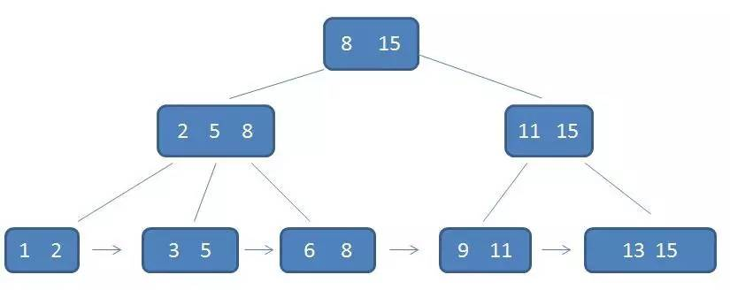
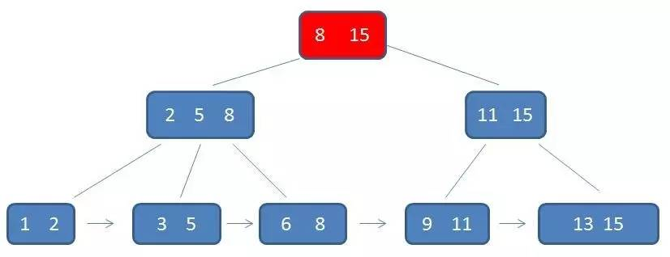
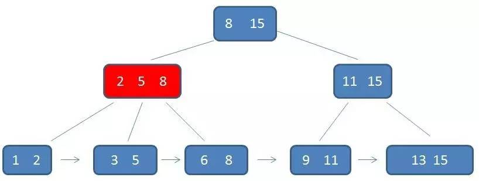
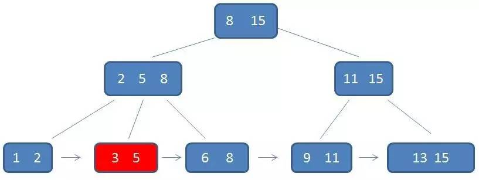
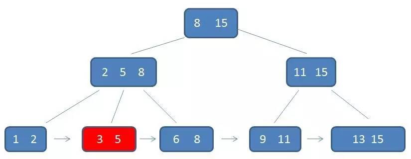
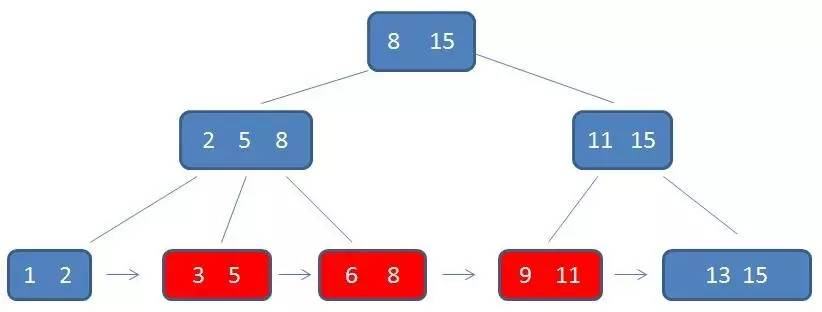

## B+Tree（B+树)

B+Tree 是 基于 [B-Tree](./B-Tree.md) 的一种变体， 有着比B-Tree更高的查询性能

### B+Tree的特征

1. 有k个子树的中间节点包含有k个元素（B树中是k-1个元素），每个元素不保存数据，只用来索引，所有数据都保存在叶子节点。

2. 所有的叶子结点中包含了全部元素的信息，及指向含这些元素记录的指针，且叶子结点本身依关键字的大小自小而大顺序链接。

3. 所有的中间节点元素都同时存在于子节点，在子节点元素中是最大（或最小）元素。

4. 在B-Tree中，每个节点都保存了卫星数据(索引所指向的数据记录，比如数据库中的某一行)，B+Tree中的卫星数据存储在叶子节点中

一个 B+Tree 如下所示:

在上面这颗树中:
 - 根节点8是子节点2,5,8的最大元素；根节点15是子节点11，15的最大元素。
 - 父节点元素都出现在子节点中， 叶子节点包含了全量的元素信息
 - 每一个叶子节点都带有指向下一个节点的指针，形成了一个有序链表
 
 ### B+Tree的优势
 
 B+Tree的优势主要体现在查询性能上
 
 #### 单元素查询
 
 单元素查询时，B+树会自顶向下逐层查找节点，最终找到匹配的叶子节点。 假如我们需要查找3这个节点
 
 第一次磁盘IO:
 
 
 第二次磁盘IO:
 
 
 第三次磁盘IO:
 
 
 单元素的整个查询流程看起来跟B-Tree差不多，但是由于B+Tree的中间节点没有卫星数据，所以同样大小的磁盘页可以存储更多的节点元素，这样在数据量相同的情况下B+Tree就会比B-Tree更加的"矮胖", 因此IO的次数就更少。其次，B+Tree的数据都在叶子节点上，那么他每一次查询的性能都很稳定
 
 #### 范围查询
 
 如果要做范围查询，B-Tree中需要依靠中序遍历，而B-Tree只需要找到叶子节点,然后在叶子节点的链表上遍历就好了，比如我们要查询3到11的元素， B+Tree的操作:
 
 
 1.自定向下，找到范围的下限3
 
 
 
 2.通过链表指针遍历到6，8在遍历到9,11结束
 
 
 
 这样比繁琐的中序遍历要简单很多
 
 #### B+Tree优势总结
 
 B+Tree相比B-Tree的优势:
 1. IO次数更少(中间节点不存储卫星数据，树的高度会更低)
 2. 查询性能稳定
 3. 范围查询简单(只需要在叶子节点做遍历即可)
 