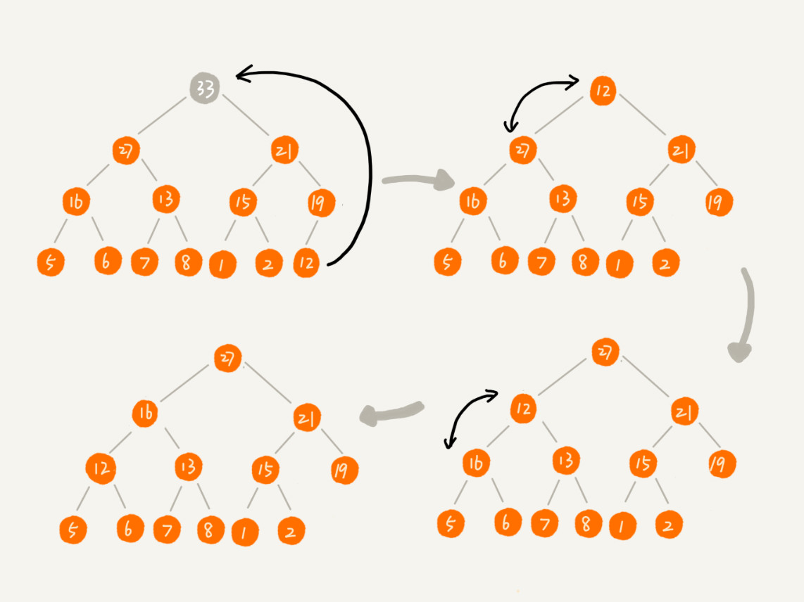

### 堆


堆的特性:
- 堆是一个完全二叉树
- 堆中的每一个节点的值必须大于等于(或者小于等于)其子树每个节点的值(大顶堆和小顶堆)

堆是完全二叉树，所以比较适合用数组存储。如果节点下标为i(第一个节点空出来)，左节点就是`2i`，右节点就是`2i+1`，父节点就是 i/2,如下：

反之， 如果第一个下标存储元素，左节点为 `2i+1`, 右节点为 `2i+2`， 父节点为 `(i-1)/2` (JDK PriorityQueue 是采取这种存储方式)

往堆中插入一个元素，需要重新调整堆，让他满足堆的特性, 这个过程叫堆化(heapify)。堆化的过程就是顺着节点所在路径，向上或向下对比，然后交换，如:

(1). 插入元素

(2). heapify(让新插入节点与父节点比较，如果不满足关系就交换两个节点，直到父子节点满足堆的关系)


把这个过程翻译成代码如下:
``` 
public class Heap {
  private int[] a; // 数组，从下标 1 开始存储数据
  private int n;  // 堆可以存储的最大数据个数
  private int count; // 堆中已经存储的数据个数

  public Heap(int capacity) {
    a = new int[capacity + 1];
    n = capacity;
    count = 0;
  }

  public void insert(int data) {
    if (count >= n) return; // 堆满了
    ++count;
    a[count] = data;
    int i = count;
    while (i/2 > 0 && a[i] > a[i/2]) { // 自下往上堆化
      swap(a, i, i/2); // swap() 函数作用：交换下标为 i 和 i/2 的两个元素
      i = i/2;
    }
  }
 }

```

(2) 删除元素

假设是大顶堆，那么堆顶元素就是最大的一个元素，把最后一个节点放到堆顶，然后利用同样的父子节点对比方法。对于不满足父子节点大小关系的，互换两个节点，并且重复进行这个过程，直到父子节点之间满足大小关系为止。这种叫从上往下的堆化方法, 如下:



翻译成代码如下:
``` 
public int remove() {
    if (count == 0) {
        return 0;
    }
    int removeElement = a[count];
    a[1] = a[count];
    heapify(a, count, 1);
    return removeElement;
}

private void heapify(int[] a, int n, int i) {
    // 自上往下堆化， 直到符合堆条件(大顶堆或小顶堆)
    while (true) {
        int maxPos = i;
        // 找到最大节点(左节点或右节点)
        if (i * 2 <= n && a[i] < a[i * 2]) {
            maxPos = i * 2;
        }
        if (i*2+1 <= n && a[maxPos] < a[i*2+1]) {
            maxPos = i*2+1;
        }
        // 当前已经完成堆化
        if (maxPos == i) {
            break;
        }
        swap(a, i , maxPos);
        i = maxPos;
    }
}
```

### 堆排序

当得到一个大顶堆(或小顶堆)后， 数组中的数据已经是按照大顶堆的特性来组织的。数组中的第一个元素就是堆顶，也就是最大的元素。我们把它跟最后一个元素交换，那最大元素就放到了下标为 n 的位置。

这个过程有点类似上面讲的“删除堆顶元素”的操作，当堆顶元素移除之后，把下标为 n 的元素放到堆顶，然后再通过堆化的方法，将剩下的 n−1 个元素重新构建成堆。
堆化完成之后，我们再取堆顶的元素，放到下标是 n−1 的位置，一直重复这个过程，直到最后堆中只剩下标为 1 的一个元素，排序工作就完成了。


- [代码实现堆排序](../../src/main/java/com/haobin/datastructure/sort/HeapSort.java)
- [堆数据结构](../../src/main/java/com/haobin/datastructure/Heap.java)