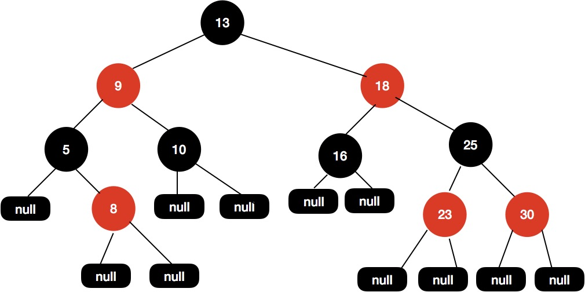

## 红黑树

红黑树是一种特殊的平衡二叉树，本质上都是为了解决排序二叉树在极端情况下退化成链表导致检索效率降低的问题。

### 红黑树的特点

1. 每个节点要么是红色，要么是黑色
2. 根节点永远是黑色
3. 所有的叶子节点都是空节点（即null），并且是黑色的
4. 每个红色节点的两个子节点都是黑色。（从每个叶子到根的路径上不会有两个连续的红色节点)
5. 从任一节点到其子树中每个叶子节点的路径都包含相同数量的黑色节点。(节点的黑高相同)

对于性质 3 中指定红黑树的每个叶子节点都是空节点，而且叶子节点都是黑色，但 Java 实现的红黑树会使用 null 来代表空节点，因此我们在遍历 Java里的红黑树的时候会看不到叶子节点，而看到的是每个叶子节点都是红色的，这一点需要注意