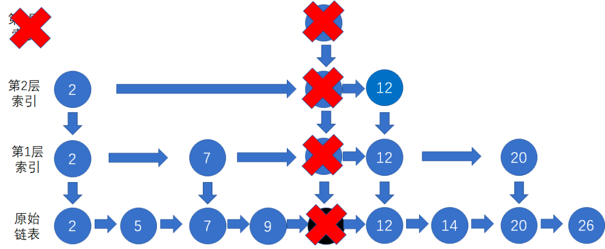

## 查找算法

### 二分查找算法

二分查找的思想是在一个有序的数据集合中，每次都通过和区间中间元素对比，将待查找的区间缩小成之前的一半，直到找到元素或者区间被缩小成0。它的时间复杂度为 O(logn)

二分查找应用的场景十分局限， 要求:
- 依赖于顺序表结构，即数组
- 数据必须是有序的
- 数据量较小的时候，顺序遍历和二分查找时间差不多。数据量太大，由于二分查找依赖一个连续的数组，无法申请太大的连续内存空间。

二分查找有两种实现，一种是循环的方式，一种是递归的方式。实现代码:
[二分查找代码实现](../../src/main/java/com/haobin/datastructure/search/BinarySearch.java)

### 跳表

二分查找需要在数组上进行， 但对链表改造一下， 就可以支持类似二分查找算法。这种改造之后的数据结构就叫做跳表。

跳表是一种支持快速插入、删除、查找的动态数据结构。Redis中的有序集合就是用跳表实现的。

对于链表来说如果要查找某个元素，需要从头到尾遍历链表，效率很低。但是如果对链表建立索引，每两个两个节点提取一个节点到上一级 ，在索引层先遍历，这样效率就高了一些，但是一层索引也没有提升多少效率，如果我们多加几层索引，效率显然就会提升很多，这种链表加多级索引的数据结构就是跳表

跳表的插入数据的效率也是很高， 入数据可以根据索引很快的找到位置，但是如果不停的往跳表中插入数据，不更新索引的话就会存在两个索引之间数据非常多的情况，极端条件下，跳表还会退化成单链表(类似二叉树的不平衡，退化成线性结构)。

作为动态的数据结构，跳表通过随机函数来维护它的平衡性。往跳表中插入数据的时候，同时将这个数据插入到部分的索引层中，通过随机函数来确定将这个节点插入到哪几级索引。比如:

跳表删除数据的时候， 需要把索引节点一一删除， 如果某一层索引的节点被删除光了，需要把整层索引删除：

跳表的实现代码： [跳表的实现](../../src/main/java/com/haobin/datastructure/search/SkipList.java)