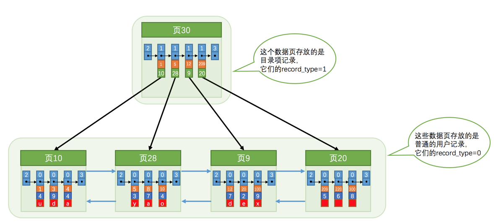

## 索引

在同一个页中，我们可以根据 slot 来定位行记录， 在很多个页中， 我们通过索引来加速这个查找效率

索引是为了快速定位页，那么大概存储的信息就是：
- 页的用户记录中最小的主键值，用key来表示
- 页码，们用page_no表示


### InnoDB中的索引结构

索引可以认为是一种目录结构

InnoDB的设计者认为目录的存储方式和普通的记录差不多，只不过他只有两个列：主键和页码。所以使用了record_type(行记录的记录头信息)来区分普通记录和目录项:

- 0：普通的用户记录
- 1：目录项记录
- 2：最小记录
- 3：最大记录



从上图可以看出单个目录项的结构，但是随着目录页的增多，想要快速定位目录页，只有为目录页在生成一个更高级的目录(与Redis的跳表类似)：


更进一步，这个结构就被抽象成了一个常用的数据结构：B+ Tree。

不论是存放用户记录的数据页，还是存放目录项记录的数据页，我们都把它们存放到B+树这个数据结构中了，所以我们也称这些数据页为节点。从图中可以看出来，我们的实际用户记录其实都存放在B+树的最底层的节点上，这些节点也被称为叶子节点或叶节点，其余用来存放目录项的节点称为非叶子节点或者内节点，其中B+树最上边的那个节点也称为根节点

### 聚簇索引

B+ Tree 本质上是一个目录， 或者说是索引， 他有两个特点：
1. 按记录的主键大小顺序排成一个单向链表
2. 叶子节点存储的是用户记录信息

包含上述特性， 索引中存储了数据的，就是聚簇索引。


### 二级索引

聚簇索引只有再搜索条件是主键的时候才能生效，因为 B+ Tree中是按主键进行排序的，如果是以其他列作为搜索条件，这种规则的 B+ Tree 就无法生效。

所以重新建几个B+ Tree ，不同的 B+Tree 中排序规则不同， 假如以C列作为索引，则规则如下:
- 以C列的大小进行记录和页的排序，包括：
    - 页内是按C列的大小顺序排成单链表
    - 页记录也根据C列大小顺序排成双向链表
- B+Tree 的叶子节点不在记录完整用户数据，而是C列+主键这两个列的值
- 目录中也不是页码+主键，而是页码+C列的值

这种索引我们可以先定位到具体的列值位置，但是叶子节点只存了主键+C列的值，所以还要去聚簇索引中查一遍其他列来获取所有的列，这个过程叫回表。也就是说根据C列的值去查找需要用到2棵B+Tree
    
### 联合索引

我们也可以同时以多个列的大小作为排序规则，也就是同时为多个列建立索引，比方说我们想让B+树按照c2和c3列的大小进行排序，这个包含两层含义：
1. 先把各个记录和页按照c2列进行排序
2. 在记录的c2列相同的情况下，采用c3列进行排序

联合索引的 B+Tree 结构规则(上述c2、c3为例)：
- 每条目录项记录都由c2、c3、页号这三个部分组成，各条记录先按照c2列的值进行排序，如果记录的c2列相同，则按照c3列的值进行排序
- B+树叶子节点处的用户记录由c2、c3和主键c1列组成

其他查找等事项都与二级索引类似，联合索引可以理解为一个特殊的二级索引

### MyISAM中的索引

InnoDB的索引，聚簇索引那棵B+Tree的叶子节点包含了完整的用户记录，但在MyISAM引擎中，索引和数据是分开存储的：
- 将表中的记录按照记录的插入顺序单独存储在一个文件中，称之为数据文件。这个文件并不划分为若干个数据页，有多少记录就往这个文件中塞多少记录就成了。我们可以通过行号而快速访问到一条记录
- 使用MyISAM存储引擎的表会把索引信息另外存储到一个称为索引文件的另一个文件中。MyISAM会单独为表的主键创建一个索引，只不过在索引的叶子节点中存储的不是完整的用户记录，而是主键值 + 行号的组合。也就是先通过索引找到对应的行号，再通过行号去找对应的记录

### 索引的一些原则

#### 全值匹配

这种情况是在查询条件中所有的索引列都会出现，比如有a,b,c三个索引，在where条件中 a,b,c三个条件都会涉及，这种情况下，a,b,c的书写顺序不影响索引的执行(mysql的查询优化器会做顺序优化)

#### 最左匹配

还是上述例子，有a,b,c三个索引(顺序也是abc)，书写语句时可以不用包含全部索引，只需要包含左边的即可

比如可以只包含a,ab,abc

如果是包含ac，那么索引只会命中a，因为a相同的记录先按照b的值排序，b相同才会按照c的值排序

如果是直接出现b(或者所有不按索引顺序的情况)就无法命中索引，进行全表扫描

#### 匹配列前缀

mysql 是按列排序的，一般的比较规则都是逐个比较字符串中每个字符的大小(第一个字符大小相同就比较第二个，以此类推)

也就是说这个字符串的前n个字符都是排序好的，所以对于字符类型的索引来说，如果只匹配它的前缀也是可以快速定位的，比如name索引，我只想查Zhang开头的记录，可以这么写
```
SELECT * FROM person_info WHERE name LIKE 'Zhang%';
```

但是如果只给后缀，或者中间某个字符串就没法快速定位了，如:
```
SELECT * FROM person_info WHERE name LIKE '%Zhang%';
```

#### 匹配范围值

因为索引列都是按着从小到大的顺序排序好，索引范围查找很方便，比如还是name索引:
```
SELECT * FROM person_info WHERE name > 'Asa' AND name < 'Barlow';
```
找到 Asa 这条记录再找到 Barlow 这条记录，由于记录都是链表串起来的，那么中间的记录就很容易取出来，在根据主键回表查一次就可以取出所有数据


注意：如果是联合索引，只有对索引最左边的一列进行范围查找才能使用索引。比如name,birthday， 只有name相同的情况下才会按着birthday排序，对于范围查找的话，并不是按着birthday排序的。所以只有再对name进行范围查找才能使用到索引。例如:
```
SELECT * FROM person_info WHERE name > 'Asa' AND name < 'Barlow' AND birthday > '1980-01-01';
```
上述sql只有name范围查找才会使用到索引，对birthday之后的搜索部分是使用不到索引的

#### 精确匹配某一列并范围匹配另一列

对于联合索引来说，进行范围查找只能使用最左边的一列，但是如果左边的列使用精确匹配，右边列进行范围匹配也是能使用到索引的:
```
SELECT * FROM person_info WHERE name = 'Ashburn' AND birthday > '1980-01-01' AND birthday < '2000-12-31';
```

#### 排序的情况

普通使用 `order by`之句的时候，我们一般把数据集加载到内存里面，然后用一些排序算法进行排序。有时候因为数据集太大，还需要借助磁盘来存放中间结果。这种速度就会比较慢，如果在order by中使用到了索引，就可能省去在内存或文件中排序的步骤

因为索引本身就是按照规则排序好的，所以直接从索引中提取出数据，然后回表获结果就好了。但是前提条件是order by的顺序也要符合联合索引的顺序，不然也是无法使用索引的

##### 排序无法使用索引的情况总结

1. WHERE子句中出现非排序使用到的索引列

where子句中使用了非索引的搜索列，这种只能先把符合条件的搜索结果找出来在排序，是使用不了索引的

2. 排序列包含非同一个索引的列

假如order by了多个列，但是不是同一个索引，这样都不在一个B+Tree 里面了，肯定也是无法使用索引排序的

3. 排序列使用了复杂的表达式

如果想使用索引排序，排序列必须是单独出现，不能用函数修饰。如:
```
SELECT * FROM person_info ORDER BY UPPER(name) LIMIT 10;
```

使用upper修饰过排序列，也是无法使用索引排序的


#### 分组

### 使用索引的代价

使用索引是加快了搜索效率，但是也会引来一些代价：

- 空间上的代价：我们需要额外的空间去存储索引
- 时间上的代价： 索引加快了查找，但是对数据的增删改，也需要对应的修改索引的结构，这样就让增删改的速度变慢了