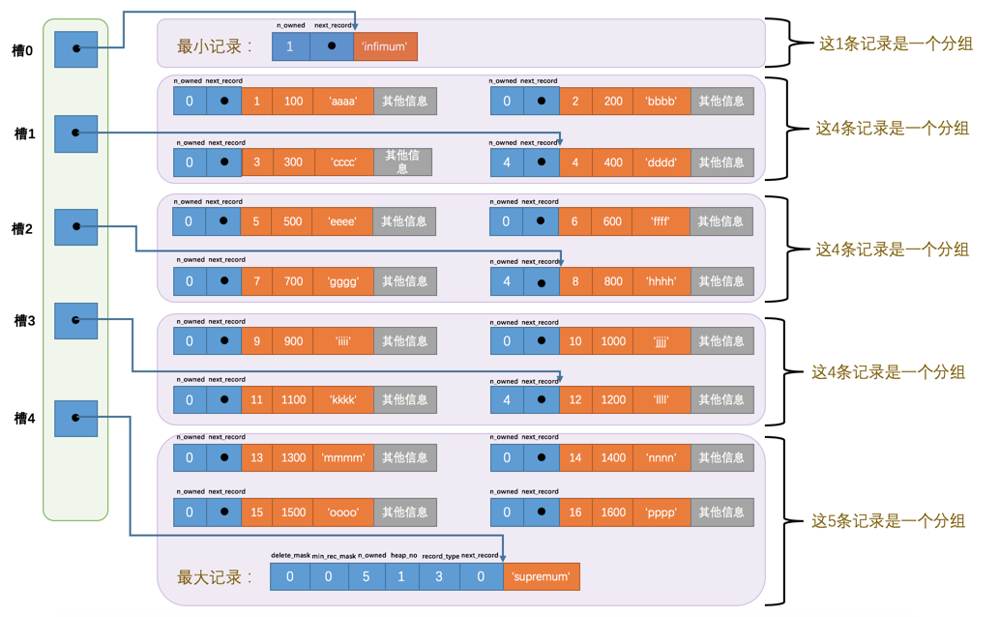

## InnoDB记录结构

我们平时是以记录为单位来向表中插入数据的，这些记录在磁盘上的存放方式也被称为行格式。目前InnoDB有四种类型的行格式：Compact、Redundant、Dynamic、Compressed

创建或修改行格式的语法是:
```
CREATE TABLE 表名 (列的信息) ROW_FORMAT=行格式名称
    
ALTER TABLE 表名 ROW_FORMAT=行格式名称
```


### Compact行格式


#### 变长字段长度列表

MySQL支持一些变长的数据类型，比如VARCHAR(M)、VARBINARY(M)、各种TEXT类型，各种BLOB类型，拥有这些数据类型的列称为变长字段，变长字段中存储多少字节的数据是不固定的，MySQL会将这些数据占用的字节数存储起来

#### NUll值列表

我们知道表中的某些列可能存储NULL值，如果把这些NULL值都放到记录的真实数据中存储会很占地方，所以Compact行格式把这些值为NULL的列统一管理起来，存储到NULL值列表中，它的处理过程是这样的：

1. 首先统计表中允许存储NULL的列有哪些。类似主键、not null 的列是不允许存储Null至的

2. 如果表中没有允许存储 NULL 的列，则 NULL值列表 也不存在了，否则将每个允许存储NULL的列对应一个二进制位：
- 二进制位的值为1时，代表该列的值为NULL
- 二进制位的值为0时，代表该列的值不为NULL

#### 记录头信息

记录头信息，它是由固定的5个字节组成。5个字节也就是40个二进制位，不同的位代表不同的意思


- 预留位1/2： 预留位，没有使用 
- delete_mask：标记该记录是否被删除， mysql不会立即删除，而是打上标记
- min_rec_mask：B+树的每层非叶子节点中的最小记录都会添加该标记
- n_owned：表示当前记录拥有的记录数
- heap_no：表示当前记录在记录堆的位置信息，0和1记录的是最大记录和最小记录的位置
- record_type：表示当前记录的类型，0表示普通记录，1表示B+树非叶子节点记录(供索引使用)，2表示最小记录，3表示最大记录
- next_record：表示下一条记录的相对位置，类似于链表的 next 指针，用来找到下一页。如果记录被删除，next record字段会变成0

#### 记录真实的数据

记录真实数据除了记录当前自定义的列数据之外，MySQL会为每个记录添加一些列(隐藏列):

| 列名  |  占用空间  | 描述 |
|---|------|--------------|
| row_id  | 6 字节 | 行id，唯一标识 |
| transaction_id | 6字节 | 事务id |
| roll_pointer | 7字节 | 回滚指针 |

InnoDB存储引擎会为每条记录都添加 transaction_id 和 roll_pointer 这两个列，但是 row_id 是可选的（在没有自定义主键以及Unique键的情况下才会添加该列）

## InnoDB页结构

页是InnoDB管理存储空间的基本单位，一个页的大小一般是16KB。

### 数据页结构


- File Header：页的一些通用信息
- Page Header：数据页专有的一些信息
- Infimum + Supremum：两个虚拟的行记录
- User Records：实际存储的行记录内容
- Free Space：页中尚未使用的空间
- Page Directory：页面的目录，页中的某些记录的相对位置
- File Trailer：页文件尾部，校验页是否完整

#### User Records 和 Free Space

每个mysql行会按照行格式存储到 User Records 中， 每插入一行记录都会从 Free Space 中划分一个记录空间到 User Records。当Free Space空间全被User Records取代后，就代表这页使用完了

#### Infimum/ supermum

user records 中行记录按照主键大小顺序，以 next record 连成一个类似于单链表的结构，而且规定 Infimum记录（也就是最小记录） 的下一条记录就本页中主键值最小的用户记录，而本页中主键值最大的用户记录的下一条记录就是 Supremum记录（也就是最大记录）

#### Page Directory

为了快速查找到对应的行，InnoDB设计了一个类似页码的数据结构。规则如下:
1. 将所有正常的记录（包括最大和最小记录，不包括标记为已删除的记录）划分为几个组。

2. 每个组的最后一条记录（也就是组内最大的那条记录）的头信息中的`n_owned`(前面行结构介绍过)属性表示该记录拥有多少条记录，也就是该组内共有几条记录

3. 将每个组的最后一条记录的地址偏移量单独提取出来按顺序存储到靠近页的尾部的地方，这个地方就是所谓的Page Directory，也就是页目录。面目录中的这些地址偏移量被称为槽（英文名：Slot），所以这个页面目录就是由槽组成的



innodb会根据slot，使用二分法来查找行记录1