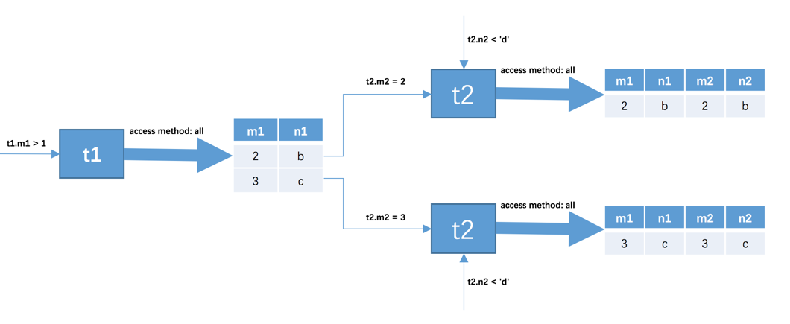

## 查询方法

MySQL访问方法大概分为两种：
1. 全表扫描

这种方法会把表上每一行的记录都扫描一遍，把符合条件的加入结果集，这种方法是耗时的

2. 使用索引

使用索引也分为几种情况：
- 主键或唯一二级索引的等值查询
- 针对普通二级索引的等值查询
- 针对索引列的范围查询
- 直接扫描整个索引

###  单表具体访问方法

explain 中也会描述这个字段 type

假如有如下表，建表语句如下:
```
CREATE TABLE single_table (
    id INT NOT NULL AUTO_INCREMENT,
    key1 VARCHAR(100),
    key2 INT,
    key3 VARCHAR(100),
    key_part1 VARCHAR(100),
    key_part2 VARCHAR(100),
    key_part3 VARCHAR(100),
    common_field VARCHAR(100),
    PRIMARY KEY (id),
    KEY idx_key1 (key1),
    UNIQUE KEY idx_key2 (key2),
    KEY idx_key3 (key3),
    KEY idx_key_part(key_part1, key_part2, key_part3)
) Engine=InnoDB CHARSET=utf8;
```

- id是主键，聚簇索引
- key1建立的idx_key1二级索引
- 为key2列建立的idx_key2二级索引，而且该索引是唯一二级索引
- 为key3列建立的idx_key3二级索引
- 为key_part1、key_part2、key_part3列建立的idx_key_part二级索引，这也是一个联合索引


#### const 

看以下两条sql语句:
```
SELECT * FROM single_table WHERE id = 1438;

SELECT * FROM single_table WHERE key2 = 3841;
```

第一条直接通过聚簇索引定位到一条记录，第二条通过索引定位到一条唯一记录，在通过聚簇索引来取得完整记录，效率都很高

分别以主键和唯一二级索引来定位一条记录的访问方法定义就是`const`， 这种等值比较是最快的

#### ref

对普通二级索引进行等值查询:
```
SELECT * FROM single_table WHERE key1 = 'abc';
```

这个查询相对于上面的主键或唯一二级索引来说， 他第一次查询出来的记录可能是多条(因为查询列并不唯一)，第二次回表也会拿多条记录。这种方式就叫`ref`

这种情况下有些特殊情况

- 二级索引列值为Null的时候：无论是普通二级索引还是唯一二级索引，索引列对Null指数量并无限制，这种情况，如果搜索条件是`key is NULL`，那么最多会使用`ref`而不是`const`

#### ref_or_null

有时候不仅需要找出某个二级索引的等值记录还需要把该列为Null的也查出来，如下:
```
SELECT * FROM single_table WHERE key1 = 'abc' OR key1 IS NULL;
```

这种查询先分别从idx_key1索引对应的B+树中找出key1 IS NULL和key1 = 'abc'的两个连续的记录范围，然后根据这些二级索引记录中的id值再回表查找完整的用户记录。 叫做 `ref_or_null`

#### range

稍微复杂一点的单表查询语句:
```
SELECT * FROM single_table WHERE key2 IN (1438, 6328) OR (key2 >= 38 AND key2 <= 79);
```

这里有三个匹配区间:
1. key2=1438
2. key2 = 6328
3. key2 ∈ [38, 79]

1,2可以理解为单点区间，3是一个闭区间。这种使用索引在一个区间之内的范围查询就叫`range`

#### index

```
SELECT key_part1, key_part2, key_part3 FROM single_table WHERE key_part2 = 'abc';
```

key_part2并不是联合索引idx_key_part最左索引列，所以我们无法使用ref或者range访问方法来执行这个语句。但是这个查询符合下边这两个条件：
1. 它的查询列表只有3个列：key_part1, key_part2, key_part3，而索引idx_key_part又包含这三个列
2. 搜索条件中只有key_part2列。这个列也包含在索引idx_key_part中

也就是说可以直接通过遍历idx_key_part索引的叶子节点的记录来比较key_part2 = 'abc'这个条件是否成立，把匹配成功的二级索引记录的key_part1, key_part2, key_part3列的值直接加到结果集中就行了。由于二级索引记录比聚簇索记录小的多（聚簇索引记录要存储所有用户定义的列以及所谓的隐藏列，而二级索引记录只需要存放索引列和主键），而且这个过程也不用进行回表操作，所以直接遍历二级索引比直接遍历聚簇索引的成本要小很多，MySQL把这种采用遍历二级索引记录的执行方式称之为：`index`

#### all

不使用索引，进行全表扫描

### 连表查询

连表查询稍微复杂一些，而且性能上面也与单表差距很大，因为它是表与表之间做笛卡尔积，然后筛选符合条件的记录。 比如三张100条记录的表做连表查询，那么就会在100^3=100万条记录间做查询，所以连接的时候过滤掉特定的记录组合是必要的。

#### 过滤条件
过滤条件分为两种：

##### 1. 涉及单表的条件

两个表做连接之前，先把单个表的查询条数做个筛选，让连接的数量尽可能小

##### 2. 涉及两个表的条件

比如t1表(n1,m1) 和 t2表(n2,m2) 中 `t1.m1=t2.m2`、`t1.n1>t2.n2` 这种两个表之间的过滤条件。

有如下sql:
```
SELECT * FROM t1, t2 WHERE t1.m1 > 1 AND t1.m1 = t2.m2 AND t2.n2 < 'd';
```
有三个过滤条件:
1. t1.m1 > 1
2. t1.m1 = t2.m2
3. t2.n2 < 'd'

那么这个连接查询的执行过程大概如下:

1. 首先确定第一个需要查询的表，这个表称之为`驱动表`。假设上述t1是驱动表，那么就需要先找出`t1.m1>1`的记录

2. 针对上一步骤中从驱动表产生的结果集中的每一条记录，分别需要到t2表中查找匹配的记录。因为是根据t1表的记录到t2表中筛选，那么t2就称为`被驱动表`。假如上一步查出两条记录：

|  m1 | n1 |
|---|-----|
|  2 |  b |
|3   |  c  |

那么相当于要查询两次t2表：
- 当t1.m1 = 2时，过滤条件t1.m1 = t2.m2就相当于t2.m2 = 2，所以此时t2表相当于有了t2.m2 = 2、t2.n2 < 'd'这两个过滤条件，然后到t2表中执行单表查询
- 当t1.m1 = 3时，过滤条件t1.m1 = t2.m2就相当于t2.m2 = 3，所以此时t2表相当于有了t2.m2 = 3、t2.n2 < 'd'这两个过滤条件，然后到t2表中执行单表查询

大概图流程如下:



#### 内连接和外连接

- 内连接：对于内连接的两个表，驱动表中的记录在被驱动表中找不到匹配的记录，该记录不会加入到最后的结果集，我们上边提到的连接都是所谓的内连接

- 外连接： 对于外连接的两个表，驱动表中的记录即使在被驱动表中没有匹配的记录，也仍然需要加入到结果集。根据选取驱动表的不同分为两种：
    - 左外连接：选取左侧的表为驱动表
    - 右外连接：选取右侧的表为驱动表
    
外连接的结果集过滤又分为两种：
-  where子句中的过滤条件：WHERE子句中的过滤条件不论是内连接还是外连接，凡是不符合WHERE子句中的过滤条件的记录都不会被加入最后的结果集

- on子句中的过滤条件：对于外连接的驱动表的记录来说，如果无法在被驱动表中找到匹配ON子句中的过滤条件的记录，那么该记录仍然会被加入到结果集中，对应的被驱动表记录的各个字段使用NULL值填充

#### 连接的原理

对于两表连接来说，驱动表只会被访问一遍，但被驱动表却要被访问到好多遍，具体访问几遍取决于对驱动表执行单表查询后的结果集中的记录条数。如果对于多个表连接的话，两表连接的结果会作为第三个表去与下一个表做连接查询。

##### 嵌套循环连接

普通的连接后的表作为新的驱动表，在去连接下一个表查找记录，这种是一个嵌套查询的过程，用伪代码可以表述如下 :
```
for each row in t1 {   #此处表示遍历满足对t1单表查询结果集中的每一条记录
    
    for each row in t2 {   #此处表示对于某条t1表的记录来说，遍历满足对t2单表查询结果集中的每一条记录
        for each row in t3 {   #此处表示对于某条t1和t2表的记录组合来说，对t3表进行单表查询
            if row satisfies join conditions, send to client
        }
    }
}
```
这个过程就像是一个嵌套的循环，所以这种驱动表只访问一次，但被驱动表却可能被多次访问，访问次数取决于对驱动表执行单表查询后的结果集中的记录条数的连接执行方式称之为嵌套循环连接,这种效率是最低的

##### 使用索引加快连接查询速度

连表查询会多次访问被驱动表，如果被驱动表每次都是全表扫描，那么性能就极其低下。

比如还是这句sql:
```
SELECT * FROM t1, t2 WHERE t1.m1 > 1 AND t1.m1 = t2.m2 AND t2.n2 < 'd';
```

t1查出的两条记录跟上面一样，那么就有两种情况:t1.m1 分别等于 2 和 3的时候:
```
SELECT * FROM t2 WHERE t2.m2 = 2 AND t2.n2 < 'd';

SELECT * FROM t2 WHERE t2.m2 = 3 AND t2.n2 < 'd';
```

我们可以对被驱动表t2做优化，在m2和n2列上添加索引
