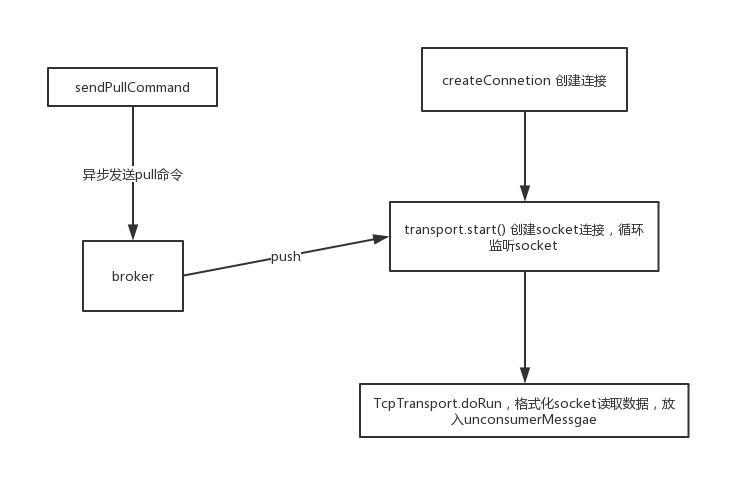

## 消息发送
### amq消息发送中同步和异步

- 同步发送： producer发送消息后，会一直阻塞知道broker反馈一个确认消息，表示broker已经处理了消息
- 异步发送： producer不需要等待broker的反馈，性能会高一些，但是可能出现消息丢失的情况

amq中默认的消息发送策略：
1. 非持久化的消息都是异步发送的
2. 持久化消息在非事务模式下是同步发送的
3. 在开启事务的情况下，消息都是异步发送

### 消息发送过程


#### producerWindowSize

producerWindow主要是针对异步发送消息时，控制允许能够积压的消息累计大小，这些消息没有得到broker的ack，在得到ack之后会减去相应的消息size，释放producerWindow


#### 发送消息源码

// ActiveMQMessageProducer.send
```
 public void send(Destination destination, Message message, int deliveryMode, int priority, long timeToLive, AsyncCallback onComplete) throws JMSException {
        checkClosed();
        if (destination == null) {
            if (info.getDestination() == null) {
                throw new UnsupportedOperationException("A destination must be specified.");
            }
            throw new InvalidDestinationException("Don't understand null destinations");
        }

        ActiveMQDestination dest;
        if (destination.equals(info.getDestination())) {
            dest = (ActiveMQDestination)destination;
        } else if (info.getDestination() == null) {
            dest = ActiveMQDestination.transform(destination);
        } else {
            throw new UnsupportedOperationException("This producer can only send messages to: " + this.info.getDestination().getPhysicalName());
        }
        if (dest == null) {
            throw new JMSException("No destination specified");
        }

        if (transformer != null) {
            Message transformedMessage = transformer.producerTransform(session, this, message);
            if (transformedMessage != null) {
                message = transformedMessage;
            }
        }

        if (producerWindow != null) {
            try {
            //窗口大小，执行是否阻塞
                producerWindow.waitForSpace();
            } catch (InterruptedException e) {
                throw new JMSException("Send aborted due to thread interrupt.");
            }
        }

        this.session.send(this, dest, message, deliveryMode, priority, timeToLive, producerWindow, sendTimeout, onComplete);

        stats.onMessage();
    }
```
// ActiveMQSession.send
```
protected void send(ActiveMQMessageProducer producer, ActiveMQDestination destination, Message message, int deliveryMode, int priority, long timeToLive,
                        MemoryUsage producerWindow, int sendTimeout, AsyncCallback onComplete) throws JMSException {

        checkClosed();
        if (destination.isTemporary() && connection.isDeleted(destination)) {
            throw new InvalidDestinationException("Cannot publish to a deleted Destination: " + destination);
        }
        //获取会话的监视器
        synchronized (sendMutex) {
            //开启事务
            doStartTransaction();
            TransactionId txid = transactionContext.getTransactionId();
            long sequenceNumber = producer.getMessageSequence();

           //......组装消息内容
           //......
           
           
             //判断是异步还是同步发送
            if (onComplete==null && sendTimeout <= 0 && !msg.isResponseRequired() && !connection.isAlwaysSyncSend() && (!msg.isPersistent() || connection.isUseAsyncSend() || txid != null)) {
            // 异步发送流程
                this.connection.asyncSendPacket(msg);
                if (producerWindow != null) {
                    // producer flow control 的一些控制
                    int size = msg.getSize();
                    producerWindow.increaseUsage(size);
                }
            } else {
            // 同步发送流程
                if (sendTimeout > 0 && onComplete==null) {
                    this.connection.syncSendPacket(msg,sendTimeout);
                }else {
                    this.connection.syncSendPacket(msg, onComplete);
                }
            }

        }
    }
```

## 消息消费和ack应答


### consumer 阻塞消费

// ActiveMQMessageConsumer.receive
```
    @Override
    public Message receive() throws JMSException {
    //检查连接
        checkClosed();
        //检查是否定义了listener，listener和当前的同步监听冲突，抛出异常
        checkMessageListener();
        //发送拉取消息指令
        sendPullCommand(0);
        //从本地队列获取消息
        MessageDispatch md = dequeue(-1);
        if (md == null) {
            return null;
        }
        //消息消费前准备
        beforeMessageIsConsumed(md);
        //消息消费后准备
        afterMessageIsConsumed(md, false);
        return createActiveMQMessage(md);
    }
```
在分析具体方法之前，说明几个属性：
- protected final MessageDispatchChannel unconsumedMessages：未消费的消息通道，里面用来储存未消费的消息，该通道容纳的最大消息数为预取值
- protected final LinkedList<MessageDispatch> deliveredMessages = new LinkedList<MessageDispatch>()：分发给该消费者但未应答的消息链表，列表中的消息顺序和被消费的顺序是相反的。
- private PreviouslyDeliveredMap<MessageId, Boolean> previouslyDeliveredMessages： 事务完整性保证，用于做本地消息重发

#### sendPullCommand
sendPullCommand检查unconsumedMessages（未曾消费消息）是否为空和PrefetchSize是不是等于0，满足才会异步发送拉取消息指令到broker，broker会推送消息到客户端的unconsumedMessages里面
```
    protected void sendPullCommand(long timeout) throws JMSException {
        //清空在deliveredMessages中还未ack的消息
        clearDeliveredList();
        if (info.getCurrentPrefetchSize() == 0 && unconsumedMessages.isEmpty()) {
            MessagePull messagePull = new MessagePull();
            messagePull.configure(info);
            messagePull.setTimeout(timeout);
            session.asyncSendPacket(messagePull);
        }
    }
```
#### dequeue

这个方法是从本地消息队列`unconsumedMessages`出队列一条消息进行消费。

broker将消息推送到本地 `unconsumedMessages` 的流程大概如下:



```
   public MessageDispatch dequeue(long timeout) throws InterruptedException {
        synchronized (mutex) {
            // 阻塞获取消息
            while (timeout != 0 && !closed && (list.isEmpty() || !running)) {
                if (timeout == -1) {
                    mutex.wait();
                } else {
                    mutex.wait(timeout);
                    break;
                }
            }
            if (closed || !running || list.isEmpty()) {
                return null;
            }
            // 弹出第一条消息
            return list.removeFirst();
        }
    }
```

#### beforeMessageIsConsumed

这里面主要是做消息消费之前的一些准备工作，如果ack不是topic的`DUPS_OK_ACKNOWLEDGE`，则所有的消息先放到deliveredMessages链表的开头

如果当前是 事务类型的会话，还需要特殊操作，判断transactedIndividualAck，如果为true，表示单条消息直接返回ack。 否则，调用ackLater，消息放入pendingack，等待处理。批量应答, client端在消费消息后暂且不发送ACK，而是把它缓存下来(pendingACK)，等到这 些消息的条数达到一定阀值时，session.commit指令把它们全部确认；这比对每条消息都逐个确认，在性能上 要提高很多，pendingACK就是事务的批量ack

```
    private void beforeMessageIsConsumed(MessageDispatch md) throws JMSException {
        md.setDeliverySequenceId(session.getNextDeliveryId());
        lastDeliveredSequenceId = md.getMessage().getMessageId().getBrokerSequenceId();
        if (!isAutoAcknowledgeBatch()) {
            synchronized(deliveredMessages) {
                //放入待确认消息列表
                deliveredMessages.addFirst(md);s
            }
            if (session.getTransacted()) {
                if (transactedIndividualAck) {
                    //可以马上确认的消息
                    immediateIndividualTransactedAck(md);
                } else {
                    //放入稍后在事务commit的时候一起确认的消息
                    ackLater(md, MessageAck.DELIVERED_ACK_TYPE);
                }
            }
        }
    }
```

#### afterMessageIsConsumed

`afterMessageIsConsumed` 主要是对消息进行ack操作
```
    private void afterMessageIsConsumed(MessageDispatch md, boolean messageExpired) throws JMSException {
        if (unconsumedMessages.isClosed()) {
            return;
        }
        if (messageExpired) {
        //消息过期了，就ack过期了
            acknowledge(md, MessageAck.EXPIRED_ACK_TYPE);
            stats.getExpiredMessageCount().increment();
        } else {
            stats.onMessage();
            if (session.getTransacted()) {
                // Do nothing.
                //会话是事务型的，就不在这里处理，是在commit的时候进行批量ack
            } else if (isAutoAcknowledgeEach()) {
            //session.isAutoAcknowledge() || ( session.isDupsOkAcknowledge() && getDestination().isQueue() );
            //非事务性的 （队列延迟确认[Dups]）或者（自动确认）执行以下逻辑
                if (deliveryingAcknowledgements.compareAndSet(false, true)) {
                    synchronized (deliveredMessages) {
                        if (!deliveredMessages.isEmpty()) {
                        //是否开启优化ack，开启则【等同开启批量确认】
                            if (optimizeAcknowledge) {
                                ackCounter++;

                                // AMQ-3956 evaluate both expired and normal msgs as
                                // otherwise consumer may get stalled
                                if (ackCounter + deliveredCounter >= (info.getPrefetchSize() * .65) || (optimizeAcknowledgeTimeOut > 0 && System.currentTimeMillis() >= (optimizeAckTimestamp + optimizeAcknowledgeTimeOut))) {
                                    MessageAck ack = makeAckForAllDeliveredMessages(MessageAck.STANDARD_ACK_TYPE);
                                    if (ack != null) {
                                        deliveredMessages.clear();
                                        ackCounter = 0;
                                        session.sendAck(ack);
                                        optimizeAckTimestamp = System.currentTimeMillis();
                                    }
                                    // AMQ-3956 - as further optimization send
                                    // ack for expired msgs when there are any.
                                    // This resets the deliveredCounter to 0 so that
                                    // we won't sent standard acks with every msg just
                                    // because the deliveredCounter just below
                                    // 0.5 * prefetch as used in ackLater()
                                    if (pendingAck != null && deliveredCounter > 0) {
                                    //达到批量确认阀值，进行批量确认
                                        session.sendAck(pendingAck);
                                        pendingAck = null;
                                        deliveredCounter = 0;
                                    }
                                }
                            } else {
                            //没开启优化，自动回传单条
                                MessageAck ack = makeAckForAllDeliveredMessages(MessageAck.STANDARD_ACK_TYPE);
                                if (ack!=null) {
                                    deliveredMessages.clear();
                                    session.sendAck(ack);
                                }
                            }
                        }
                    }
                    deliveryingAcknowledgements.set(false);
                }
            } else if (isAutoAcknowledgeBatch()) {
            //非事务性的 topic的延时确认【等同开启批量确认】
                ackLater(md, MessageAck.STANDARD_ACK_TYPE);
            } else if (session.isClientAcknowledge()||session.isIndividualAcknowledge()) {
            //客户端手动确认，CLIENT_ACKNOWLEDGE 批量确认之前所有，INDIVIDUAL_ACKNOWLEDGE确认当前单条
                boolean messageUnackedByConsumer = false;
                synchronized (deliveredMessages) {
                    messageUnackedByConsumer = deliveredMessages.contains(md);
                }
                if (messageUnackedByConsumer) {
                    ackLater(md, MessageAck.DELIVERED_ACK_TYPE);
                }
            }
            else {
                throw new IllegalStateException("Invalid session state.");
            }
        }
    }
```
optimizeAcknowledge是开启批量回传的标记，可以设置批量回传阀值来优化回传效率。

综上我们可以看到
- 针对事务性会话
所有的事务性会话，不管如何设置ack模式，都是按照以下原则：同一事务内部，在执行commit之前接收到的消息，都是没有ack的，放在pendingAck里面。在进行session.commit的时候会把pendingAck里面的消息全部一次确认，视为手动批量确认也。事务会话要求效率高，因此都是批量进行ack的，没有别的方式

- 非事务性会话 

1. 队列延迟确认（DUPS_OK_ACKNOWLEDGE）或者自动确认（AUTO_ACKNOWLEDGE）：如开启optimizeAcknowledge优化回传，相当于批量回传，达到设置的阀值之后自动批量回传ack 。没有开启的话就都是马上自动发送标准的ack，回传单条数据

2. topic的延时确认（DUPS_OK_ACKNOWLEDGE）：统一都是批量确认，达到设置的阀值之后自动批量回传ack

3. 手动确认方式，类似session.commit

#### 消息重发

activeMQ中的消息重发，指的是消息可以被broker重新分派给消费者，不一定的之前的消费者。重发消息之后，消费者可以重新消费。消息重发的情况有以下几种：
1. 事务会话中，当还未进行session.commit()时，进行session.rollback()，那么所有还没commit的消息都会进行重发
2. 使用客户端手动确认的方式时，还未进行确认并且执行Session.recover()，那么所有还没acknowledge的消息都会进行重发
3. 所有未ack的消息，当进行session.closed()关闭事务，那么所有还没ack的消息broker端都会进行重发，而且是马上重发
4. 消息被消费者拉取之后，超时没有响应ack，消息会被broker重发