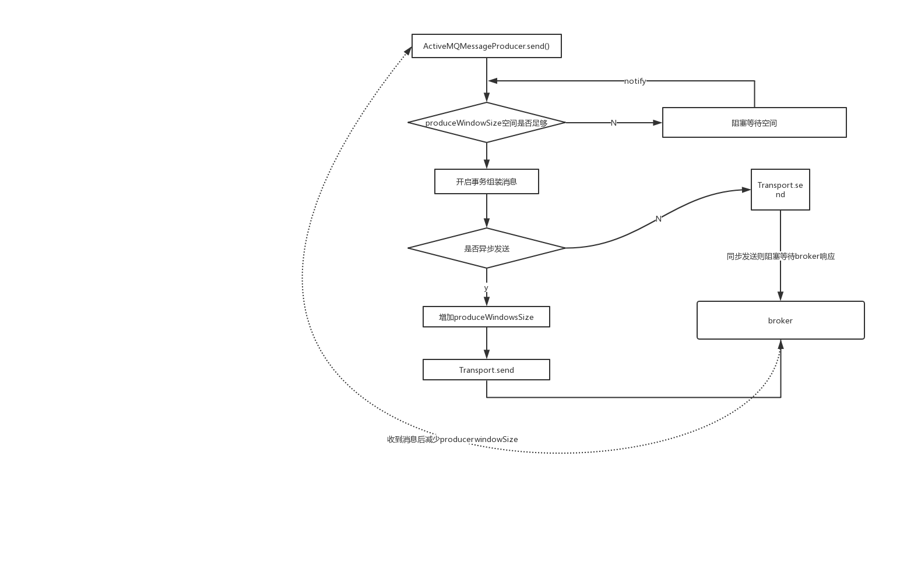

## 消息发送
### amq消息发送中同步和异步

- 同步发送： producer发送消息后，会一直阻塞知道broker反馈一个确认消息，表示broker已经处理了消息
- 异步发送： producer不需要等待broker的反馈，性能会高一些，但是可能出现消息丢失的情况

amq中默认的消息发送策略：
1. 非持久化的消息都是异步发送的
2. 持久化消息在非事务模式下是同步发送的
3. 在开启事务的情况下，消息都是异步发送

### 消息发送过程


#### producerWindowSize

producerWindow主要是针对异步发送消息时，控制允许能够积压的消息累计大小，这些消息没有得到broker的ack，在得到ack之后会减去相应的消息size，释放producerWindow


#### 发送消息源码

// ActiveMQMessageProducer.send
```
 public void send(Destination destination, Message message, int deliveryMode, int priority, long timeToLive, AsyncCallback onComplete) throws JMSException {
        checkClosed();
        if (destination == null) {
            if (info.getDestination() == null) {
                throw new UnsupportedOperationException("A destination must be specified.");
            }
            throw new InvalidDestinationException("Don't understand null destinations");
        }

        ActiveMQDestination dest;
        if (destination.equals(info.getDestination())) {
            dest = (ActiveMQDestination)destination;
        } else if (info.getDestination() == null) {
            dest = ActiveMQDestination.transform(destination);
        } else {
            throw new UnsupportedOperationException("This producer can only send messages to: " + this.info.getDestination().getPhysicalName());
        }
        if (dest == null) {
            throw new JMSException("No destination specified");
        }

        if (transformer != null) {
            Message transformedMessage = transformer.producerTransform(session, this, message);
            if (transformedMessage != null) {
                message = transformedMessage;
            }
        }

        if (producerWindow != null) {
            try {
            //窗口大小，执行是否阻塞
                producerWindow.waitForSpace();
            } catch (InterruptedException e) {
                throw new JMSException("Send aborted due to thread interrupt.");
            }
        }

        this.session.send(this, dest, message, deliveryMode, priority, timeToLive, producerWindow, sendTimeout, onComplete);

        stats.onMessage();
    }
```
// ActiveMQSession.send
```
protected void send(ActiveMQMessageProducer producer, ActiveMQDestination destination, Message message, int deliveryMode, int priority, long timeToLive,
                        MemoryUsage producerWindow, int sendTimeout, AsyncCallback onComplete) throws JMSException {

        checkClosed();
        if (destination.isTemporary() && connection.isDeleted(destination)) {
            throw new InvalidDestinationException("Cannot publish to a deleted Destination: " + destination);
        }
        //获取会话的监视器
        synchronized (sendMutex) {
            //开启事务
            doStartTransaction();
            TransactionId txid = transactionContext.getTransactionId();
            long sequenceNumber = producer.getMessageSequence();

           //......组装消息内容
           //......
           
           
             //判断是异步还是同步发送
            if (onComplete==null && sendTimeout <= 0 && !msg.isResponseRequired() && !connection.isAlwaysSyncSend() && (!msg.isPersistent() || connection.isUseAsyncSend() || txid != null)) {
            // 异步发送流程
                this.connection.asyncSendPacket(msg);
                if (producerWindow != null) {
                    // producer flow control 的一些控制
                    int size = msg.getSize();
                    producerWindow.increaseUsage(size);
                }
            } else {
            // 同步发送流程
                if (sendTimeout > 0 && onComplete==null) {
                    this.connection.syncSendPacket(msg,sendTimeout);
                }else {
                    this.connection.syncSendPacket(msg, onComplete);
                }
            }

        }
    }
```

## 消息消费和ack应答


