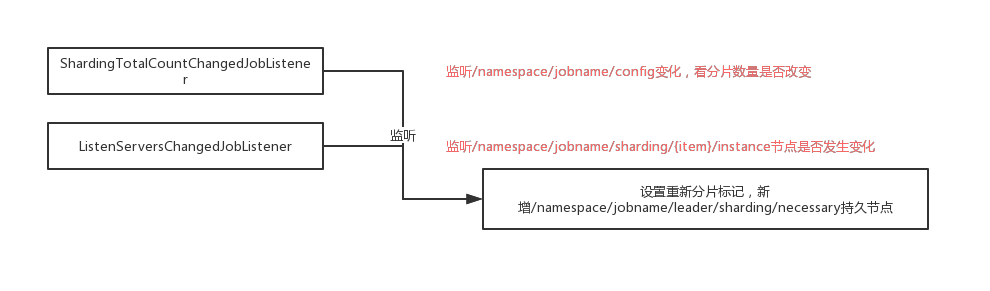
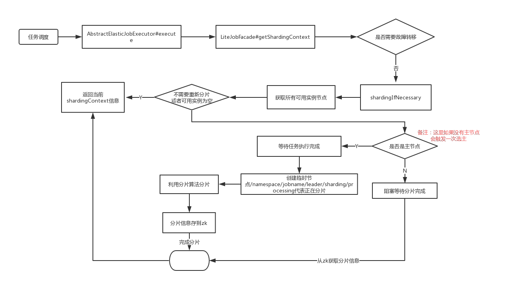

## elastic-job 分片原理

从选主的流程中可以看到，`ListenManager#startAllListeners`会开启所有的监听器，分片的监听器是`shardingListenManager`

### 分片监听器
`shardingListenManager#start`:
```
public void start() {
    addDataListener(new ShardingTotalCountChangedJobListener());
    addDataListener(new ListenServersChangedJobListener());
}
```
- ShardingTotalCountChangedJobListener：监听总分片数量事件管理器，是TreeCacheListener（curator的事件监听器）子类
- ListenServersChangedJobListener：任务job服务器数量(运行时实例）发生变化后的事件监听器


### ShardingTotalCountChangedJobListener

```
protected void dataChanged(final String path, final Type eventType, final String data) {
    if (configNode.isConfigPath(path) && 0 != JobRegistry.getInstance().getCurrentShardingTotalCount(jobName)) {
        int newShardingTotalCount = LiteJobConfigurationGsonFactory.fromJson(data).getTypeConfig().getCoreConfig().getShardingTotalCount();
        if (newShardingTotalCount != JobRegistry.getInstance().getCurrentShardingTotalCount(jobName)) {
            shardingService.setReshardingFlag();
            JobRegistry.getInstance().setCurrentShardingTotalCount(jobName, newShardingTotalCount);
        }
    }
}
```
job的配置信息存储在`namespace/jobname/config`节点上，存储内容为json格式的配置信息。 

如果`namespace/jobname/config`节点的内容发生变化，zk会触发该节点的节点数据变化事件，如果zk中存储的分片节点数量与内存中的分片数量(JobRegistry.getInstance())不相同的话，调用ShardingService设置需要重新分片标记（创建`namespace/jobname/leader/sharding/necessary`持久节点）并更新内存中的分片节点总数

### ListenServersChangedJobListener '

```
protected void dataChanged(final String path, final Type eventType, final String data) {
    if (!JobRegistry.getInstance().isShutdown(jobName) && (isInstanceChange(eventType, path) || isServerChange(path))) {
        shardingService.setReshardingFlag();
    }
}
```
分片节点（实例数）发生变化事件监听器，当新的分片节点加入或原的分片实例宕机后，需要进行重新分片。 

当`namespace/jobname/servers`或`namespace}/jobname/instances`路径下的节点数量是否发生变化，如果检测到发生变化，设置需要重新分片标识

### 分片逻辑

分片监听器会在zk特定的目录发生变化的时候判断是否需要重新设置分片标记。

触发重新分片的逻辑是在每个调度任务执行之前，获取分片信息(分片上下文)，根据分片信息从服务器拉取不同的数据，进行任务处理, 入口代码是:`AbstractElasticJobExecutor#execute `:
```
public final void execute() {
    try {
        jobFacade.checkJobExecutionEnvironment();
    } catch (final JobExecutionEnvironmentException cause) {
        jobExceptionHandler.handleException(jobName, cause);
    }
    // 获取分片信息
    ShardingContexts shardingContexts = jobFacade.getShardingContexts();
    ........
}
```
`jobFacade.getShardingContexts()`去拉取分片信息:
```
public ShardingContexts getShardingContexts() {
    // 是否启动故障转移
    boolean isFailover = configService.load(true).isFailover();
    if (isFailover) {
        List<Integer> failoverShardingItems = failoverService.getLocalFailoverItems();
        if (!failoverShardingItems.isEmpty()) {
            return executionContextService.getJobShardingContext(failoverShardingItems);
        }
    }
    // 根据标记，决定是否执行重新分片
    shardingService.shardingIfNecessary();
    // 获取运行在本作业的分片信息合集
    // 遍历所有分片信息 namespace/jobname/sharding/{分片item}下所有instance节点
    // 判断其值jobinstanceId是否与当前的jobInstanceId相等，相等则认为是本节点的分片信息
    List<Integer> shardingItems = shardingService.getLocalShardingItems();
    if (isFailover) {
        shardingItems.removeAll(failoverService.getLocalTakeOffItems());
    }
    // 移除本作业实例中所有的禁用分片
    // 禁用分片的存储目录为 namespace/jobname /sharding/{分片item}/disable
    shardingItems.removeAll(executionService.getDisabledItems(shardingItems));
    // 返回当前节点的分片上下文环境,这个主要是根据配置信息（分片参数）与当前的分片实例，构建ShardingContexts对象
    return executionContextService.getJobShardingContext(shardingItems);
}
```
上述就是获取分片信息的流程


#### shardingService.shardingIfNecessary 分片流程
分片的流程：
```
public void shardingIfNecessary() {
    // 1
    List<JobInstance> availableJobInstances = instanceService.getAvailableJobInstances();
    // 2
    if (!isNeedSharding() || availableJobInstances.isEmpty()) {
        return;
    }
    // 3
    if (!leaderService.isLeaderUntilBlock()) {
        // 4
        blockUntilShardingCompleted();
        return;
    }
    // 5
    waitingOtherJobCompleted();
    LiteJobConfiguration liteJobConfig = configService.load(false);
    int shardingTotalCount = liteJobConfig.getTypeConfig().getCoreConfig().getShardingTotalCount();
    log.debug("Job '{}' sharding begin.", jobName);
      // 6
    jobNodeStorage.fillEphemeralJobNode(ShardingNode.PROCESSING, "");
    // 7
    resetShardingInfo(shardingTotalCount);
    // 8
    JobShardingStrategy jobShardingStrategy = JobShardingStrategyFactory.getStrategy(liteJobConfig.getJobShardingStrategyClass());
    // 9
    jobNodeStorage.executeInTransaction(new PersistShardingInfoTransactionExecutionCallback(jobShardingStrategy.sharding(availableJobInstances, jobName, shardingTotalCount)));
    log.debug("Job '{}' sharding complete.", jobName);
}
```
1. 获取当前可用的实例，获取当前可用实例，首先获取` namespace/jobname/instances`目录下的所有子节点，并且判断该实例节点的IP所在服务器是否可用,`namespace}/jobname/servers/ip`节点存储的值如果不是DISABLE，则认为该节点可用

2. 如果不需要重新分片（`namespace/jobname/leader/sharding 
/necessary`节点不存在, 即没有打上重新分片的标记）或当前不存在可用实例，则返回

3. 判断是否是主节点，如果当前正在进行主节点选举，则阻塞直到选主完成

4. 如果当前节点不是主节点，则等待主节点分片结束。分片是否结束的判断依据是`namespace/jobname/leader/sharding/necessary`节点存在或`namespace/jobnameleader/sharding/processing`节点存在(表示正在执行分片操作)，如果分片未结束，使用Thread.sleep方法阻塞100毫米后再试。如果分片结束则return

5. 能够走到这一步，说明是主节点。主节点在执行分片之前，首先等待该批任务全部执行完毕，判断是否有其他任务在运行的方法是判断是否存在`namespace/jobname/sharding/{分片item}/running`，如果存在，则使用Thread.sleep(100)，然后再判断

6. 创建临时节点`namespace/jobname/leader/sharding/processing`节点，表示分片正在执行

7. 重置分片信息。先删除`namespace/jobname/sharding/{分片item}/instance`节点，然后创建`namespace/jobname/sharding/{分片item}`节点（如有必要)。然后根据当前配置的分片总数量，如果当前`namespace/jobname/sharding`子节点数大于配置的分片节点数，则删除多余的节点（从大到小删除）

8. 获取配置的分片算法类，常用的分片算法为平均分片算法（AverageAllocationJobShardingStrategy）

9. 在一个事务内创建相应的分片实例信息`namespace/jobname/{分片item}/instance`,节点存放的内容为JobInstance实例的ID


### 总体运行流程图

首先是监听器监听:


分片流程:

