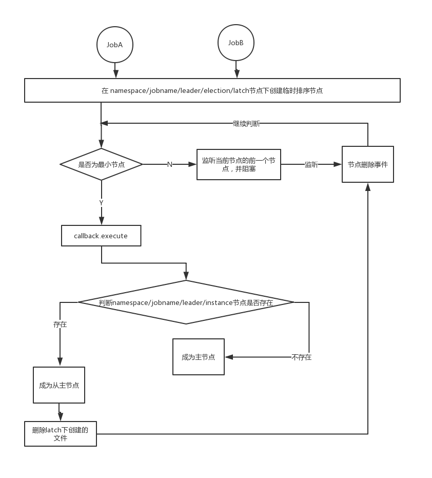

## elastic job 选主过程分析


### elastic-job 选主

elastic 主从服务器共同构成任务调度的分片节点。

ElasticJob的主服务器的职责是根据当前存活的任务调度服务器生成分片信息，然后拉取属于该分片的任务数据执行任务。为了避免分片信息的不统一，ElasticJob必须从所有的调度服务器中选择一台为主服务器，由该台服务器统一计算分片信息，其他服务根据该分片信息进行任务调度。 

作业服务器注册启动的入口是: `SchedulerFacade#registerStartUpInfo`:
```
public void registerStartUpInfo(final boolean enabled) {
    // 启动所有ZK事件监听器
    listenerManager.startAllListeners();
    // 选主
    leaderService.electLeader();
    // 注册并持久化服务器信息(server信息)
    serverService.persistOnline(enabled);
    // 注册并持久化作业运行实例(instance信息)
    instanceService.persistOnline();
    // 设置是否需要重新分片
    shardingService.setReshardingFlag();
    // 启动调节分布式作业状态不一致服务
    monitorService.listen();
    if (!reconcileService.isRunning()) {
        reconcileService.startAsync();
    }
}
```

#### elastic-job 监听器

- ElectionListenerManager：主节点选举监听管理器 
- ShardingListenerManager：分片监听管理器。 
- FailoverListenerManager：失效转移监听管理器。 
- MonitorExecutionListenerManager：幂等性监听管理器。 
- ShutdownListenerManager：运行实例关闭监听管理器。 
- TriggerListenerManager：作业触发监听管理器。 
- RescheduleListenerManager：重调度监听管理器。 
- GuaranteeListenerManager：保证分布式任务全部开始和结束状态监听管理器。

#### 监听器工作机制

以`ElectionListenerManager`为例,`ElectionListenerManager#start`:
```
public void start() {
    addDataListener(new LeaderElectionJobListener());
    addDataListener(new LeaderAbdicationJobListener());
}
```
JobNodeStorage#addDataListener(zk添加监听器):
```
public void addDataListener(final TreeCacheListener listener) {
    TreeCache cache = (TreeCache) regCenter.getRawCache("/" + jobName);
    cache.getListenable().addListener(listener);
}
```
首先获取TreeCache，然后使用`cahce.getListenable().addListener(TreeCacheListener)` 加入zk监听器中


#### ElectionListenerManager选主

`ElectionListenerManager`监听器是用来选举主节点的，执行的方法是`LeaderService.electLeader`:
```
public void electLeader() {
    log.debug("Elect a new leader now.");
    jobNodeStorage.executeInLeader(LeaderNode.LATCH, new LeaderElectionExecutionCallback());
    log.debug("Leader election completed.");
}
```

LeaderNode.LATCH是选主所用分布式锁节点目录， 具体路径是:`Namespace/ {JobName}/leader/election/latch`
```
public void executeInLeader(final String latchNode, final LeaderExecutionCallback callback) {
    try (LeaderLatch latch = new LeaderLatch(getClient(), jobNodePath.getFullPath(latchNode))) {
        // 步骤1
        latch.start();
        // 步骤2
        latch.await();
        // 步骤3
        callback.execute();
    //CHECKSTYLE:OFF
    } catch (final Exception ex) {
    //CHECKSTYLE:ON
        handleException(ex);
    }
}
```
这里选主直接使用cautor开源框架提供的实现类`org.apache.curator.framework.recipes.leader.LeaderLatch`, LeaderLatch需要传入两个参数：
1. CuratorFramework client：curator框架客户端
2. latchPath：锁节点路径, 这里的路径为`namespace/ {Jobname}/leader/election/latch`

上述步骤1，2启动 `LeaderLatch`，这是zk客户端`curator`的方法，如果LeaderLatch是主节点，就返回，否则阻塞在这里等待下一次选举。

如果获得了分布式锁后，执行callback回调方法：`LeaderService$LeaderElectionExecutionCallback`:
```
@RequiredArgsConstructor
class LeaderElectionExecutionCallback implements LeaderExecutionCallback {
    
    @Override
    public void execute() {
        if (!hasLeader()) {
            jobNodeStorage.fillEphemeralJobNode(LeaderNode.INSTANCE, JobRegistry.getInstance().getJobInstance(jobName).getJobInstanceId());
        }
    }
}
```
这里判断,如果`namespace/{jobname}/leader/election/instance`节点不存在则创建该临时节点，节点里面的数据是`IP地址@-@进程ID`。代码是:`jobInstanceId = IpUtils.getIp() + DELIMITER + ManagementFactory.getRuntimeMXBean().getName().split("@")[0]`


整个选主的流程是：



### 参考资料
- [elastic-job服务初始化](https://blog.csdn.net/qq924862077/article/details/82858694)
- [zookeeper客户端curator的使用](https://www.jianshu.com/p/fc502570bf24)